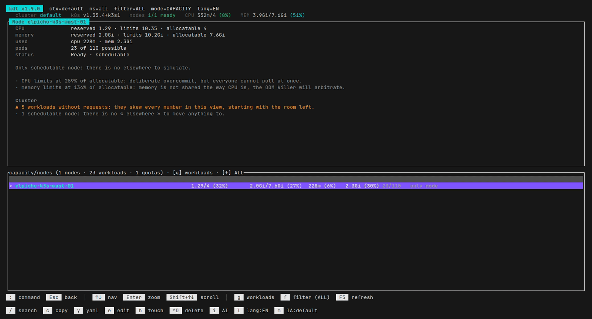
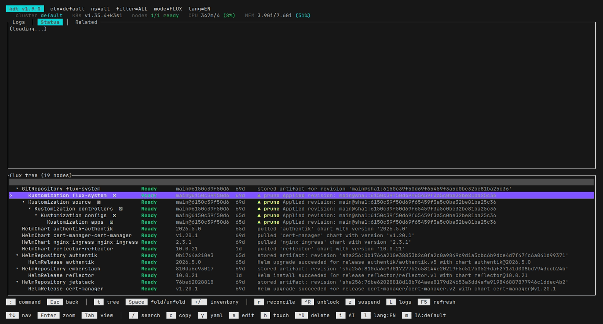
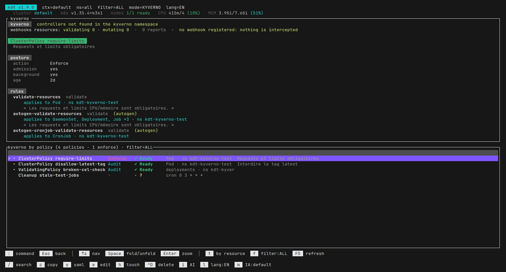
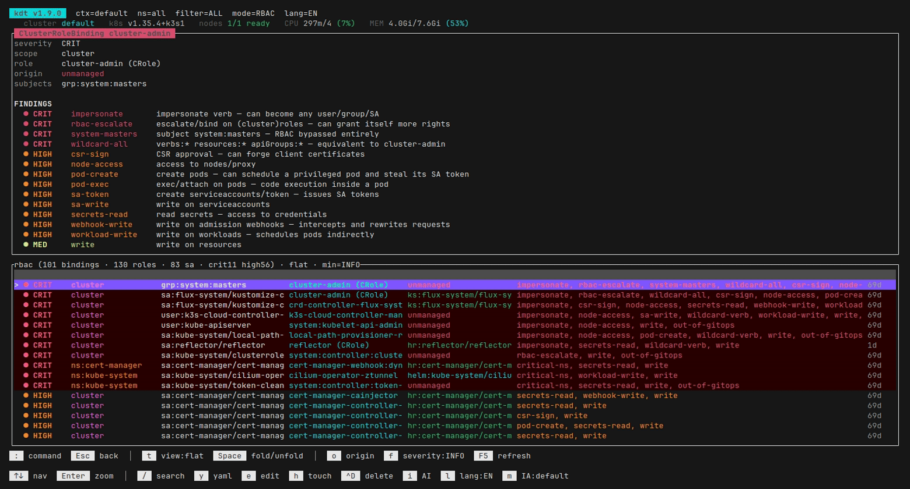

# kdt — Kubernetes Diagnostic Tools

A Rust TUI to watch Kubernetes events live, inspect the cluster view by view, run a diagnostic,
export a PDF report and ask an AI for an analysis.

📖 [Version française](README.md)


## Install

### Homebrew (macOS and Linux x86_64)

```bash
brew install agardenat/kdt/kdt
```

Serves the macOS universal binary (Apple Silicon + Intel) or the static Linux x86_64 binary
depending on the platform. Linux arm64 is not distributed through Homebrew.

### Linux packages (x86_64)

```bash
sudo dpkg -i kdt_<version>_amd64.deb      # Debian / Ubuntu
sudo rpm -i kdt-<version>-1.x86_64.rpm    # RHEL / Fedora / openSUSE
```

### Pre-built binary

Archives on the [Releases](https://github.com/agardenat/kdt/releases) page:

```bash
tar xzf kdt-linux-x86_64.tar.gz   # or kdt-macos-universal.tar.gz
sudo install -m 0755 kdt /usr/local/bin/kdt
```

### From source

```bash
cargo build --release   # → target/release/kdt
```

### Upgrade

Homebrew — `brew update` refreshes the tap, without which `upgrade` does not see the new version:

```bash
brew update
brew upgrade agardenat/kdt/kdt
```

Packages and archives: install the new version over the old one with the same commands as above.
`kdt --version` reports what is in place.

## Usage

```bash
kdt [OPTIONS]
```

| Option | Description | Default |
|---|---|---|
| `-n, --namespace <NS>` | Namespace to watch | all |
| `-A, --all-namespaces` | All namespaces | — |
| `--context <CTX>` | kubeconfig context | current context |
| `--buffer-size <N>` | Event buffer size | `5000` |

Connects through the standard kubeconfig, `proxy-url` included. When DNS returns both IPv4 and
IPv6 for the API server, IPv4 is tried first. The app starts on the events view.

## Command palette (`:`)

`:` opens a k9s-style prompt: `Tab` completes, `Enter` runs, `Esc` cancels. `events`, `namespace`
and `workloads` take a namespace argument (`:ns kube-system`, `:pods istio-system`); `all` (or
`*`/`0`) targets every namespace.

| Command | Aliases | View |
|---|---|---|
| `events [ns]` | `ev`, `event` | Events |
| `namespace [ns]` | `ns`, `namespaces` | Namespace picker |
| `workloads [ns]` | `wl`, `pods`, `po`, `deploy` | Workloads / Pods |
| `nodes` | `no`, `node` | Nodes |
| `flux` | `fl`, `ks`, `hr` | FluxCD |
| `flux-logs` | `logs`, `fluxlogs` | Aggregated Flux controller logs |
| `rbac` | `rb`, `roles`, `bindings`, `sec` | RBAC |
| `vuln` | `cve`, `cves`, `vulns` | Vulnerabilities |
| `secrets` | `secret`, `se`, `tls` | Secrets and TLS certificates |
| `certs` | `certificates`, `issuers`, `challenges`, `acme` | cert-manager |
| `kyverno` | `ky`, `policies`, `polr`, `cpol`, `admission` | Kyverno |
| `reflector` | `refl`, `mirror`, `miroir` | Reflector |
| `velero` | `vel`, `backup`, `backups`, `schedules` | Velero, backups and schedules |
| `restores` | `restore`, `restauration` | Velero, restores |
| `bsl` | `backupstoragelocation`, `backuprepositories` | Velero, storage and repositories |
| `k8ssandra` | `k8c`, `cassandra`, `cass`, `datacenter` | K8ssandra / Cassandra, ring side |
| `medusa` | `med`, `medusabackup`, `cassbackup` | K8ssandra, Medusa backup side |
| `reaper` | `rea`, `repair`, `repairs` | K8ssandra, operations and Reaper |
| `rancher` | `ranch`, `cattle`, `users`, `identities` | Rancher, accounts and identities |
| `projects` | `project`, `proj` | Rancher, projects and namespaces |
| `tokens` | `token`, `apikey`, `kubeconfigs` | Rancher, tokens |
| `argocd` | `argo`, `acd`, `apps`, `applications` | Argo CD, Applications side |
| `appsets` | `appset`, `applicationsets` | Argo CD, ApplicationSets side |
| `appprojects` | `appproject`, `appproj` | Argo CD, AppProjects side |
| `argorepos` | `argorepo`, `argoclusters` | Argo CD, registered repositories and clusters |
| `configmaps` | `cm`, `config` | ConfigMaps |
| `services` | `svc`, `service` | Services / Endpoints |
| `forward` | `pf`, `portforward`, `tunnels` | Running port-forwards (over the current view) |
| `ingress` | `ing`, `ingressclass` | Ingress / IngressClass |
| `netpol` | `np`, `networkpolicies`, `cilium`, `calico` | NetworkPolicies (native, Cilium, Calico) |
| `storage` | `stockage`, `pvc`, `claims` | Storage, claim side (PVC → PV) |
| `pv` | `sc`, `storageclass`, `persistentvolume` | Storage, volume side (SC → PV) |
| `capacity` | `cap`, `marge`, `headroom` | Capacity, node side |
| `quota` | `quotas`, `rq`, `resourcequota` | Capacity, quota side |
| `quit` | `q` | Quit |

## Keys

### Everywhere

| Key | Action |
|---|---|
| `↑` `↓` `PgUp` `PgDn` | Navigate |
| `Enter` | Full-screen detail (or fold/unfold in a tree) |
| `Shift-↑/↓`, `g` / `G` | Scroll the detail pane |
| `²` (or `=`) | Hide / show the top pane: the table takes the whole screen (kept across sessions) |
| `/` | Search (see below) |
| `y` | YAML of the selected object (`t`: neat ↔ raw) |
| `e` / `h` / `Ctrl-D` | Edit / touch / delete the object (guardrails) |
| `i` | AI pane |
| `c` | Copy the view (OSC 52, works over SSH) |
| `L` / `m` | Language FR/EN · next AI provider |
| `F5` | Refresh |
| `:` | Command palette |
| `Esc` | Back (clears the active search first) |
| `q` / `Ctrl-C` | Quit |

### Per view

| View | Keys |
|---|---|
| Events | `s` freeze scrolling · `Tab` Logs/Status/Related tab · `a`/`w`/`x` All/Warnings/Errors filter · `p`/`C`/`f` logs previous run/container/follow · `n`/`0` namespace filter · `N` nodes of the pod · `E` shell · `D` diagnostic · `X` PDF export |
| Workloads | `t` list ↔ tree · `Space` (or `→`/`←`) unfold the pod into its containers · `s` scale · `r` rescale/recycle/restart · `E` shell · `p`/`C`/`f` logs · `n`/`0` namespace |
| Nodes | `u` usage view · `s` sort · `o` cordon/uncordon/drain · `p`/`P` PDF export |
| Capacity | `g` world (nodes → workloads → quotas) · `f` problems only |
| FluxCD | `r` reconcile menu · `Ctrl-R` unblock · `z` suspend/resume · `t` table ↔ tree · `Space` fold/unfold · `a` auto-reveal of the branches reconciling or failing · `←`/`→` pan the message of the selected row (`Home` resets it) · `l` logs of every controller · `Tab` Logs/Status/Related/Inventory tab |
| Vulnerabilities | `f` severity floor (all → HIGH+ → CRIT) |
| cert-manager | `Space` fold/unfold · `t` tree ↔ list · `←`/`→` pan the message · `f` ALL/PROBLEMS/IN-FLIGHT · `s` jump to the Secret · `r` renew, restart ACME |
| Kyverno | `Space` fold/unfold · `t` by policy ↔ by resource · `←`/`→` pan the message · `f` ALL/PROBLEMS/ENFORCE · `P` actions (purge stuck `UpdateRequest`s) |
| Reflector | `Space` fold/unfold · `g` sources → mirrors → orphans · `f` ALL/PROBLEMS · `s` jump to the source · `r` force re-reflection |
| Velero | `g` backups → restores → storage · `t` grouping · `f` filter · `+`/`-` backup contents · `o` actions · `l` run log · `n`/`0` namespace |
| K8ssandra | `Space` fold/unfold · `g` cluster → backups → operations · `f` ALL/PROBLEMS · `l` log of the container at fault · `s` node stats (tpstats, compactionstats, netstats) or Reaper repairs · `S` node snapshots (listsnapshots) · `o` actions |
| Rancher | `g` users → access → projects → tokens · `f` ALL/PROBLEMS · `o` actions (issue a token, change a TTL, revoke, set a setting) · `e`, `h`, `Ctrl-D` deliberately absent |
| Argo CD | `g` apps → sets → projects → repos · `f` ALL/PROBLEMS · `r` actions (refresh, hard refresh, sync, sync + prune, terminate) |
| RBAC | `Space` fold/unfold · `t` flat → by subject → by binding → by role · `f` severity floor · `o` jump to the managing Flux object |
| Network | `g` services → ingress → netpol · `t` grouping (services/ingress) · `f` port-forward the Service · `F` running port-forwards · `n`/`0` namespace |
| Storage | `g` claims ↔ volumes · `t` parent/child nesting · `f` problems only · `n`/`0` namespace |
| Diagnostic | `r` re-run · `p`/`P` PDF export |
| YAML | `t` neat ↔ raw · `c` copy · `r` reload |

In the events view the cursor **follows** the stream by default (`↻` indicator); moving up anchors
it on a specific event, `Esc` resumes following.

### Search (`/`)

Available everywhere, case-insensitive, and **kept across view changes**. The status bar always
shows the query and its effect (`/coredns  (3)`).

- **table**: keeps only matching rows (namespace, name, kind, reason, message, plus whatever
  identifies the view: RBAC subjects, images, keys — never values — of secrets);
- **text pane** (logs, diagnostic, AI, YAML): highlights matches and jumps between them with
  `Ctrl-N` / `Ctrl-P`, position shown (`/glob  (3/500)`).

## The views

- **Events** — watches `Event` objects. `a`/`w`/`x` filter All / Warnings / Errors, `s` freezes
  scrolling, `Tab` cycles the detail tabs (Logs / Status / Related). Logs: `p` shows the container's
  previous run (the only place the logs of a `CrashLoopBackOff` pod survive), `C` switches
  container, `f` follows. `N` lists the nodes of the pod, `E` opens a shell, `D` runs the
  diagnostic, `X` exports the PDF.
- **Workloads** — workload → pod tree (Deployment, StatefulSet, DaemonSet, Job; the tree also shows
  finished Jobs and workloads scaled to 0), or flat pod list with `t` — `:pods` opens the flat list
  directly, `:workloads` the tree. `Space`, `→` and `←` unfold a pod into its containers (init, regular, ephemeral):
  state, usage against *their own* requests/limits, age of the last start. Actions target the
  workload even from one of its pod rows: `s` scale, `r` rescale / recycle / restart. On a container
  row, `E` opens a shell in that container and the Logs tab narrows to it. `n`/`0` change namespace.
- **Nodes** — list, detail, CPU/memory usage (`u`), sort (`s`), PDF export (`p`/`P`). The detail
  panel gives conditions, capacity/allocatable, system info, addresses, reservations and recent OOM
  kills, then annotations, labels and taints at its end — what is on screen when the cursor moves to
  another node. `o` opens the operations: cordon, uncordon, drain. The drain prints a report before any eviction: pods no
  controller will recreate, PDBs that will refuse, pods with no room elsewhere, `emptyDir` data
  lost, static pods.
- **Capacity** (`:capacity`, `:quota`) — three worlds through `g`, `f` keeps problems only.
  - *nodes*: node-loss simulation (first-fit, largest pod first, on requests, honouring taints,
    `nodeSelector` and `required` node affinity) and the pods with nowhere to land;
  - *workloads*: pods with no requests (invisible to the scheduler), oversized pods, pods at their
    own limit;
  - *quotas*: `ResourceQuota`s about to refuse the next creation.

  

- **FluxCD** — cluster-wide inventory, dependency tree (`t`), applied objects with their live state
  (Inventory tab), controller logs (`l`, or `:flux-logs` for the aggregate). The tree follows the
  real dependencies, Helm chain included: HelmRepository → HelmChart (the one `status.helmChart`
  names) → HelmRelease. A folded node announces what it hides — `✗n` failures, `↻n` reconciles in
  flight. `a` sets the automatic reveal: by default the branches that reconcile or fail unfold on
  their own and fold back once they return to Ready, the folds set by hand being kept underneath.
  `z` suspends / resumes.
  `r` opens the reconcile menu: resource, `--with-source`, root sync, plus force upgrade and reset
  on a HelmRelease. `Ctrl-R` opens the unblock flow: kdt derives leads from the controller message,
  confirms each one against the cluster and offers the matching action — delete an orphaned webhook,
  strip finalizers, `resetAt` then `forceAt` on a Helm release stuck in pending.

  

- **Vulnerabilities** — per-image CVEs from **Trivy Operator** `VulnerabilityReport`s (CVSS score,
  number of fixable CVEs) and the risk on the Kubernetes version itself (official feed, latest patch
  of the minor as target, `EOL` badge). `f` sets the severity floor (all → HIGH+ → CRIT). Without
  Trivy Operator, only the k8s version part is shown.
- **cert-manager** (`:certs`) — issuance chain Issuer → Certificate → CertificateRequest → Order →
  Challenge → served Secret. `Space` folds/unfolds (healthy chains start folded, failing ones
  unfolded), `t` switches tree/list, `f` filters ALL / PROBLEMS / IN-FLIGHT, `s` jumps to the
  Secret, `r` renews or restarts the ACME challenge. Detections: incomplete DNS propagation,
  challenge not presented, ACME rate limit, late renewal, Secret out of sync, JKS/PKCS12 keystore
  requested but absent from the Secret, missing truststore, unresolvable `passwordSecretRef`.
- **Kyverno** — policies joined to reports: a report names its rule with a plain string, and the
  view goes and reads the matching rule in the policy. `t` switches by policy / by resource, `Space`
  folds/unfolds, `f` filters ALL / PROBLEMS / ENFORCE, `P` opens the action menu (purge the
  `UpdateRequest`s stuck in Pending/Failed). Shown here: the `autogen-*` rules (the ones reports
  name), the difference between `fail` (the resource violates) and `error` (the rule cannot evaluate
  — a policy bug), admission denials (absent from reports, present only as Events), the
  `UpdateRequest` backlog, and the `kyverno-resource-*` webhook count (at zero, Kyverno intercepts
  nothing at all).

  

- **Reflector** ([kubernetes-reflector](https://github.com/emberstack/kubernetes-reflector)) —
  sources, mirrors and orphans through `g`, `f` filters ALL / PROBLEMS, `s` jumps to the source, `r`
  forces re-reflection. Detections: namespace blocked by a same-named object, mirror edited by hand
  (reflector only compares `reflected-version`, never the content), the real scope of the anchored
  regexes (an empty list means all namespaces), mirrors still waiting for the copy.
- **RBAC** — flat audit list by default, three tree orientations through `t` (by subject, by
  binding, by role), `f` sets the severity floor, `o` jumps to the managing Flux object. Severity is
  computed **per binding**: a Role alone is inert, and the same ClusterRole is harmless in a
  RoleBinding and critical in a ClusterRoleBinding. Shows template ClusterRoles rebound namespace by
  namespace, the composition of aggregated roles (`admin`, `edit`, `view`), bindings naming a
  non-existent ServiceAccount, and roles nobody binds.

  

- **Velero** (`:velero`, `:restores`, `:bsl`) — backups and schedules, restores, locations and
  repositories.
  - `PartiallyFailed` is counted as a failure.
  - kdt evaluates the schedule cron itself: a schedule that stopped firing (velero reports it
    nowhere, it simply creates no backup), a TTL shorter than the cron period, an unavailable
    location, a kopia repository with no maintenance, namespaces holding PVCs that no schedule
    covers any more.
  - `o`: run a backup from a schedule, pause it, restore, delete a backup through a
    `DeleteBackupRequest` (deleting the object deletes nothing, the next sync brings it back). `l`
    fetches the run log.
  - `+` unfolds what the backup actually holds — namespaces, then kinds, then objects. *Restore
    (options)* uses it to prefill a narrowed `Restore`: namespaces to tick, remapping into another
    namespace, a filter by kind and by label, and the choice between skipping and overwriting what
    already exists. Velero cannot target an object by name: the selection stops at the kind.
- **K8ssandra / Cassandra** (`:k8ssandra`, `:medusa`, `:reaper`) — three worlds through `g`: cluster
  ring, Medusa backups, operations and Reaper. `f` filters ALL / PROBLEMS, `Space` folds/unfolds,
  `l` opens the log of the container at fault.
  - The backup world's title shows the age of the last backup covering **every node** of the
    datacenter, a partial run counting as a failure. Detections: a schedule whose
    `lastExecution`/`nextSchedule` stays clean although the run failed, a purge CronJob completing
    green while purging nothing, successful runs missing from the catalogue (the `sync` MedusaTask
    never ran). A restore stops the datacenter, which is stated before it is started.
  - The ring comes from the `cassandra` container's management API, reached through the apiserver
    pod proxy (no port-forward, no `kubectl`, no exec): `nodetool status` and `describecluster` as
    typed data — UN/DN state, load, tokens, schema agreement. A pod is joined to its ring entry on
    the address, not on the `hostID` in `status.nodeStatuses`: that field goes stale, and the view
    says so when the two disagree.
  - `s`: `tpstats`, `compactionstats` and `netstats` for the selected node (Reaper repairs in the
    operations world). `S`: `listsnapshots`, folded per tag, with both sizes — the total (a
    directory of hard links, shared with the live SSTables) and `True size`, the only space deleting
    the tag gives back. On a 3.11 node, which does not date its snapshots, the date of
    `truncated-`/`dropped-` tags is read from the tag itself.
  - `o`: back up now, restore, purge or resync the Medusa catalogue, and the `CassandraTask` jobs
    (cleanup, upgradesstables, compaction, scrub, rolling restart).
- **Rancher** (`:rancher`, `:projects`, `:tokens`) — four worlds through `g`, `f` filters ALL /
  PROBLEMS. Read-only apart from `o`; `e`, `h` and `Ctrl-D` are absent.
  - *users*: the Rancher id (`u-4oivhvq2jk`, the one RoleBindings and audit logs carry) and the real
    identity next to it — the CN of an LDAP/AD distinguished name, the FreeIPA `uid` — read from the
    `User` and `UserAttribute` objects, with the provider, the directory groups, the global roles
    and when those groups were last refreshed.
  - *access*: the three binding kinds collapsed into one subject → role → scope list; the binding
    Rancher gives every account is sorted last.
  - *projects*: namespaces, members, owners, quota.
  - *tokens*: first the lifetime settings — `auth-token-max-ttl-minutes` (the ceiling),
    `kubeconfig-default-token-ttl-minutes`, `auth-user-session-ttl-minutes` — with the value in
    force, the shipped default and which of the two applies (Rancher reads `0` as "no expiry"). Then
    the tokens, with a `SCOPE` column (`clusterName` empty = every managed cluster *and* the Rancher
    API; set = that cluster only) and a `KIND` column: `kubeconfig` (one per download), `session`
    (the login itself — revoking it signs the account out), `api` (a key made in *Account & API
    Keys*, with no label and `isDerived`), `provisioning`, `telemetry`.
  - On a **downstream** cluster the Rancher CRDs exist and are empty: the view says so and falls
    back on what the agent projected, the RoleBindings labelled with the Rancher binding that
    created them. Groups appear in clear text (the full DN), accounts stay `u-…` ids nothing on this
    cluster can resolve, and every row declares it.
  - `o`, on the local cluster only (refused with a reason on a downstream): **issue a token** for
    the selected account (a `Token` object shaped like the ones Rancher creates — same labels,
    `isDerived`, reconstructed `userPrincipal` — with a 54-character secret from `/dev/urandom`,
    shown once and written nowhere), **change the TTL** of a token, **revoke** it (deleting the
    `Token` object is the only real revocation), **set** a lifetime setting. These are the same
    objects one would `kubectl apply` by hand; kdt adds no privilege.
- **Argo CD** (`:argocd`, `:appsets`, `:appprojects`, `:argorepos`) — four worlds through `g`, `f`
  filters ALL / PROBLEMS.
  - *apps*: every `Application` with **both of its states side by side**, `sync` and `health`. A
    `sync: Unknown` says the controller could not build the desired state at all (an expired git
    credential, an unreachable Helm repository, a failing plugin): the `health` next to it was
    computed *before* the failure, so the view says so and dims it instead of showing it green. The
    `POLICY` column reads `syncPolicy.automated` as it behaves — `automated: { enabled: false }` is
    auto-sync declared and off, shown as `manual`. Then the project, the destination (the registered
    cluster's name, not its url), the revision, how many resources are out of sync, the last
    operation with its age, and the age of the last comparison.
  - The detail panel gives the diagnosis **before** the inventory: Argo conditions (`*Error` in red,
    `OrphanedResourceWarning` as information — it is a project setting), a failed operation with its
    message and retry count, a project that does not exist, a destination absent from the registered
    clusters, no comparison for more than three periods (`timeout.reconciliation` read from
    `argocd-cm`), and whether the cascade finalizer is present — that is, whether deleting the
    Application also deletes what it deployed. Then the resources not in their expected state, the
    history of deployed revisions, and the images.
  - *sets*: `ApplicationSet` with its generators, the Applications it actually generated (read
    through `ownerReferences`) and their state, `syncPolicy.applicationsSync`,
    `preserveResourcesOnDeletion`, `goTemplate`, and the controller's conditions.
  - *projects*: `AppProject` with its Application count, `sourceRepos` (a `*` shown as such),
    destinations, allowed/denied resource lists, sync windows, and the roles with a read/write
    distinction computed from the verb of each Casbin policy.
  - *repos*: repositories, credentials templates and clusters, which are not CRDs but `Secret`s
    labelled `argocd.argoproj.io/secret-type`. kdt decodes their **addressing** (url, name, type,
    project, scope) and infers the authentication method from which keys **exist** — no credential
    is read. The `USED` column counts the Applications referring to them.
  - Unrelated to any CRD: the top of the panel names the install (namespace discovered through
    `argocd-cm`, UI url, comparison period, component readiness) and reports Applications living
    outside the namespaces the controller honours (`application.namespaces`).
  - `r`: **refresh** and **hard refresh** (the `argocd.argoproj.io/refresh` annotation), **sync** and
    **sync + prune** (the `.operation` field, with no pinned revision: the controller resolves the
    Application's own `targetRevision`), and **terminate** while an operation is running. These are
    the writes the `argocd` CLI performs; kdt adds no privilege of its own.
- **Network** (`:services`, `:ingress`, `:netpol`) — three worlds through `g`: Services/Endpoints,
  Ingress/IngressClass, NetworkPolicies. Native policies are shown with their target, their
  `policyTypes` and the effect per direction: `Deny` (direction governed, no rule allows anything),
  `AllowAll` (empty `from`/`to`), `Selective` (explicit peers), `Unaffected` (direction not in
  `policyTypes`). Cilium and Calico CRDs are listed as they are, with no verdict.
- **Port-forward** (`f` on a Service, `F` or `:forward` for the list) — the tunnel is opened by kdt
  itself, with no `kubectl`: the form lists the Service ports, offers the same number as the local
  port (`0` takes any free one), `Enter` starts or stops. It listens on `127.0.0.1`, and the table's
  `FORWARD` column shows the local port (`→ :8080`, `+n` when there is more than one). The target is
  resolved through the EndpointSlices: the first **ready** endpoint, and the container port it
  declares (so a named `targetPort` is followed). What cannot be forwarded is named: `ExternalName`
  Service, non-TCP port, no endpoint, no ready endpoint. The `F` list gives the pod reached, the
  state, the connections open and served, and `d` stops one. The tunnels live inside the kdt
  process: they survive a change of view or namespace, and go away with it.
- **Storage** (`:storage`, `:pv`) — two worlds through `g` (PVC → PV, SC → PV), `t` nests
  parent/child, `f` keeps problems only, `n`/`0` change namespace. Detections: missing StorageClass,
  no default class (or two), `WaitForFirstConsumer` waiting on a pod, class with no provisioner, a
  `ProvisioningFailed` left by the provisioner (its message wins), `Released` PVs,
  `reclaimPolicy: Delete` surfaced on the PVC, `RWO` PVCs mounted by several pods.
- **Secrets / ConfigMaps** — inventories, with TLS certificate expiry and their consumers.
- **Diagnostic** (`D`) — a battery of checks: API health, version, nodes, system namespaces,
  `kube-system` pods, CoreDNS, CNI, validating and mutating webhooks, Rancher, failing pods, PVs,
  storage, capacity, Flux, cert-manager, Kyverno, Velero, Reflector, K8ssandra, RBAC, recent
  warnings. A module absent from the cluster is reported as Info. `r` re-runs, `p`/`P` export the
  PDF.
- **Extract** (`X`) — full PDF report of the cluster state into `~/Downloads`.
- **AI** (`i`) — sends the current context to an OpenAI-compatible API; the answer is streamed (SSE)
  and rendered as it arrives. `L` re-runs it in the other language, `m` switches provider.

## Writing to the cluster

All navigation is **read-only**. The only writes are the ones a key explicitly triggers, and they go
through guardrails.

| Key | Write | Guardrails |
|---|---|---|
| `e` | Full `PUT`, locked on `resourceVersion` | **Before**: GitOps-owned object that the next reconcile will overwrite, spec held by a controller, `can-i update` denied, object being deleted, spec frozen after creation. **After**: every changed field classified *applied* / *ignored* / *rejected by the API* |
| `Ctrl-D` | `delete` with *background* propagation | GitOps ownership, GitOps entry point (Kustomization/HelmRelease/Application), `Namespace` and CRD (cascade), `ownerReferences`, system namespace, finalizers |
| `h` | Merge patch of two annotations | None |
| `o` (Nodes) | `spec.unschedulable` patch, then evictions | Full drain report before a single eviction |
| `r` / `z` | Reconcile, suspend, scale, restart, renew | Armed confirmation inside the menu |
| `Ctrl-R` | Delete an admission config, strip finalizers | Type the object's exact name |
| `r` (Argo CD) | The `argocd.argoproj.io/refresh` annotation, the `.operation` field, `status.operationState.phase` | Armed confirmation in the menu; prune is its own entry, never a checkbox |
| `o` (Rancher) | Create a `Token`, patch its `.ttl`, delete a `Token`, patch a `Setting` | Armed confirmation, then an entry whose unit is shown; refused on a downstream cluster; the issued secret is shown once and written nowhere |

**No warning blocks**, but **the default answer is no**: `Enter` and `Esc` both cancel, and only the
key that opened the pane moves towards the write. A ⛔ finding (`e`, `Ctrl-D`, drain) requires
**retyping the object's exact name** to override.

### Worth knowing

- **`e`** — editor picked in order: `$KDT_EDITOR`, `$KUBE_EDITOR`, `$VISUAL`, `$EDITOR`, else `vi`
  (arguments allowed: `KDT_EDITOR="nvim -u NONE"`). The temp file is `0600` (a `Secret` passes
  through it) and wiped when the pane closes. Invalid YAML or an API refusal sends you back to the
  editor with the buffer intact.
- **`h`** — sets `kdt.io/touched-at` (**millisecond** timestamp, and it matters: a patch that
  changes nothing doesn't bump `resourceVersion`, so it calls no webhook) and `kdt.io/touched-by`.
  Used to push an object back through admission: re-evaluate a Kyverno policy, wake a controller.
  **No confirmation** — in the events view, where the cursor follows the stream, freeze it (`s`)
  before touching; the status bar always names the object actually touched.
- **Targeting** — in the events view, `y`/`e`/`h`/`Ctrl-D` act on the object the **event is about**
  (its `involvedObject`), never on the Event. In Kyverno, a violation row targets the **offending
  resource**, a policy row targets the policy.
- **`E`** — shell into a pod: kdt **hands the terminal to `kubectl exec -it`** and takes it back
  afterwards, exactly as `e` hands it to `$EDITOR`. It is the only feature depending on an external
  binary, and a missing one is reported before the screen is given away.

## Configuration

Optional JSON file, looked up in order: `$KDT_CONFIG` (or `$KEV_CONFIG`),
`$XDG_CONFIG_HOME/kdt/config.json`, `~/.config/kdt/config.json`.

```json
{
  "language": "en",
  "active_provider": "openai",
  "providers": [
    {
      "name": "openai",
      "base_url": "https://api.openai.com/v1",
      "api_key": "sk-...",
      "model": "gpt-4o",
      "context_window": 128000
    },
    { "name": "local", "base_url": "http://localhost:11434/v1", "api_key": "ollama", "model": "qwen2.5-coder" }
  ]
}
```

`m` cycles through providers at runtime; the active one shows in the AI status bar (`[EN · openai]`).
The flat `openai_base_url` / `openai_api_key` / `openai_model` keys and the environment variables are
still supported as a `default` provider.

`context_window` is the model's window **in tokens**. When set, kdt bounds the prompt to fit: ~4096
tokens reserved for the answer, then the prompt is filled by priority (event and status first, logs,
then context), dropping the lowest-priority sections and saying so in the prompt. The value is never
sent to the API. Behind a multi-model proxy, declare the window of the **smallest** reachable model.

The `hide_top_panel` key remembers the last fold of the top pane (`²`): it is rewritten on its own
at every keypress, like `language`, and brings the interface back in the same state next session.

### Language

The whole UI is bilingual (panes, diagnostics, PDF reports, prompts). Selection order: the
`language` config key, then the system locale (`LC_ALL`, `LC_MESSAGES`, `LANG`, `LANGUAGE` — `fr*`
gives French, anything else English), else French.

`L` switches at runtime, even inside a view, and rewrites **only the `language` key** of the config
file (everything else, permissions included, is left alone). Kubernetes jargon stays in English on
both sides (`pod`, `node`, `taint`, `requests`…), as do column headers.

### Environment variables

| Variable | Role |
|---|---|
| `OPENAI_API_KEY` | AI API key |
| `OPENAI_BASE_URL` / `OPENAI_API_BASE` | OpenAI-compatible endpoint |
| `OPENAI_MODEL` | Model |
| `OPENAI_CONTEXT_WINDOW` | Context window of the `default` provider |
| `KDT_KUBECTL` | Binary used by `E` (default: `kubectl` from `PATH`) |
| `KDT_EXEC_SHELL` | Command passed to `sh -c` by `E` (default: `bash` if present, else `sh`) |
| `KDT_CONFIG` / `KEV_CONFIG` | Config file path |
| `KDT_LOG` / `KEV_LOG` | Log file path |
| `RUST_LOG` | Log filter (`warn` by default) |

## Security / privacy

- **Data sent to the AI**: `i` and `X` transmit the current cluster context — event message, **pod
  logs** (up to 200 lines), status, related resources. Logs may contain secrets: use trusted
  endpoints only. Only bookkeeping metadata is stripped, not application data.
- **Endpoint**: an `http://` `base_url` sends the key and the payload in the clear. Prefer `https://`
  or a local endpoint.
- **API key**: stored in clear text in `config.json` — `chmod 600`. It is never logged.
- **Cluster access**: read-only apart from the writes listed above, all of which the API refuses if
  the kubeconfig isn't allowed. Two shell-outs, both on demand: `$EDITOR` (`e`) and
  `kubectl exec -it` (`E`).
- **PDF rendering**: AI content is escaped before being evaluated as Typst markup, and code blocks
  go through `raw()` — no injection possible.

## Development

```bash
cargo build --release       # target/release/kdt
packaging/build-deb.sh      # → dist/kdt_<version>_amd64.deb
packaging/build-rpm.sh      # → dist/x86_64/kdt-<version>-1.x86_64.rpm
packaging/build-all.sh      # both
```

Release profile: `lto = thin`, `codegen-units = 1`, `panic = abort`, stripped symbols, `mimalloc`
allocator. A static musl target is configured (`target/x86_64-unknown-linux-musl`) and is what the
packages ship. The packaging scripts need no root, write into `dist/`, and read name and version
from `Cargo.toml`; they require `dpkg-deb` / `rpmbuild`.

Application logs: `$KDT_LOG`, `$XDG_STATE_HOME/kdt/kdt.log`, `~/.local/state/kdt/kdt.log`, else
`/tmp/kdt.log`. PDF reports: `~/Downloads/kdt-extract-<context>-<timestamp>.pdf`.

### Modules (`src/`)

| Module | Role |
|---|---|
| `main.rs` · `cli.rs` · `config.rs` | Bootstrap, arguments (clap), config file |
| `ui.rs` | ratatui TUI: modes, rendering, keyboard |
| `events.rs` | Event watcher, logs, status, nodes, usage |
| `pods.rs` · `svc.rs` · `configmaps.rs` | Workloads, Services/Ingress, ConfigMaps |
| `portfwd.rs` | Service port-forward (EndpointSlice resolution, local listener) |
| `flux.rs` · `repair.rs` | FluxCD (inventory, reconcile, tree) and the `Ctrl-R` unblock |
| `rbac.rs` · `secrets.rs` · `certmanager.rs` | Scored RBAC, Secrets/TLS, cert-manager chain |
| `kyverno.rs` · `reflector.rs` · `vulnerabilities.rs` | Kyverno, Reflector, CVEs |
| `velero.rs` | Velero: backups, schedules (cron evaluated), restores, locations |
| `argocd.rs` | Argo CD: Applications, ApplicationSets, AppProjects, repositories and clusters |
| `rancher.rs` | Rancher: accounts and their real identities, bindings, projects, tokens and TTL settings |
| `k8ssandra.rs` · `mgmtapi.rs` | K8ssandra/Medusa/Reaper, and the Cassandra management API through the apiserver proxy |
| `storage.rs` | PVC / PV / StorageClass and their diagnostic rules |
| `yaml.rs` · `edit.rs` · `delete.rs` · `touch.rs` | YAML, edit, delete, touch |
| `diagnostic.rs` · `extract.rs` · `pdf.rs` | Diagnostic, extraction, Typst rendering |
| `enrich.rs` · `ai.rs` | Context related to an event, OpenAI client |
| `lang.rs` · `clip.rs` | FR/EN string table, OSC 52 clipboard |

Stack: Rust 2021 · `kube` 3.1 (rustls, socks5) · `k8s-openapi` 0.27 · `ratatui` 0.30 · `tokio` ·
`reqwest` · `typst` 0.14.

## License

[Apache 2.0](LICENSE).
